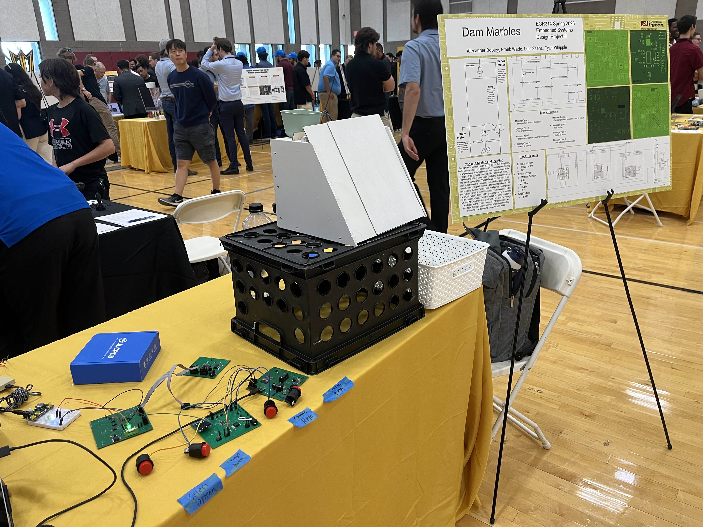

## HOME

- Project Name: Providing STEMS
- Team 202
- Alexander Dooley, Frank Wade, Luis Saenz, Tyler Whittle
- Preparation Date: April 20, 2025
- Spring 2025
- ASU, EGR 314, Prof. Dan Aukes
  
### Team Member Schematics

| Team Members           | Schematic Links |
| --------------------------------------------- | ----------- |
|Tyler                              | [Sensor Subsystem (Hall Effect Sensor)](https://crypt1dking.github.io/Schematic/) |
|Luis                               | [Wifi Subsystem](https://luisasaenz.github.io/schematic/) |
|Frank                              | [Motor Subsystem (Stepper Motor)](https://wadian802.github.io/Schematic/) |
|Alex                               | [HMI (Human Machine Interface) Subsystem](https://ajdoole.github.io/Schematic%20Design/Schematic/) |

## Welcome

On September 12th, 1962, John F Kennedy spoke to the nation and told them that we are going to the moon before the end of the decade. Within this speech, President Kennedy also said “The growth of our science and education will be enriched by new knowledge of our universe and environment, by new techniques of learning and mapping and observation, by new tools and computers for industry, medicine, the home as well as the school. Technical institutions, such as Rice, will reap the harvest of these gains,”. Today, education gives forth STEM to help the students of today, follow in the footsteps of their grandfathers. Through the learning of science, technology, engineering and mathematics, like those who touched the heavens, the generation of tomorrow might one day take humanity somewhere yet to feel the human touch. 

Grains of curiosity and dreams, sprinkled among the seeds of STEM, are cultivated by both teachers and professors. 
> To aid the growth of these grains, the mission of Team 202 is to take S.T.E.M concepts found in education and deliver them in a manner students would understand. 

Team 202 will design a mechanical device to show scientific principles of energy conversion between different states, that also highlights the use of technology and engineering. Our goal is to add more seeds of curiosity and try to inspire more students to pursue more STEM related jobs. 

To achieve our task, Team 202 got together to discuss end goals for the project, deciding on a device that can task driven or function autonomously. By doing this, Team 202 can also develop our own skills in engineering and robotics, increasing our effectiveness as engineers. The team will assign roles to operate more smoothly, each member will practice effective communication through various means and be accountable for the task they are given

## Results

